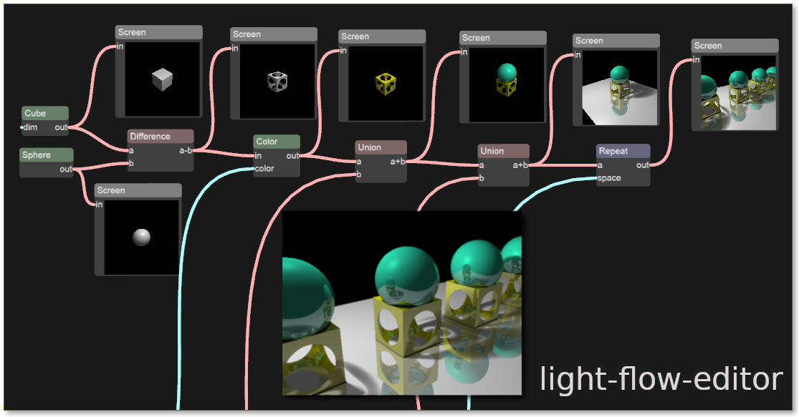

LightFlowEditor
---------------
[![travis][badge.travis]][travis]
[![issues][badge.issues]][issues]
[![license][badge.license]][license]
[![contributors][badge.contributors]][contributors]

[badge.travis]: https://img.shields.io/travis/com/arthursonzogni/light-flow-editor?logo=travis
[badge.issues]: https://img.shields.io/github/issues-raw/arthursonzogni/light-flow-editor
[badge.license]: https://img.shields.io/github/license/arthursonzogni/light-flow-editor?color=black
[badge.contributors]: https://img.shields.io/github/contributors/arthursonzogni/light-flow-editor?color=blue

[travis]: https://travis-ci.com/ArthurSonzogni/light-flow-editor
[issues]: https://github.com/ArthurSonzogni/light-flow-editor/issues
[license]: http://opensource.org/licenses/MIT
[contributors]: https://github.com/ArthurSonzogni/light-flow-editor/graphs/contributors

A 3D constructive geometry editor.
This is based on [SMK](https://github.com/ArthurSonzogni/smk) and [smkflow](https://github.com/ArthurSonzogni/smkflow)

Demo
----

[https://arthursonzogni.com/LightFlowEditor/latest/](https://arthursonzogni.com/LightFlowEditor/latest/)
